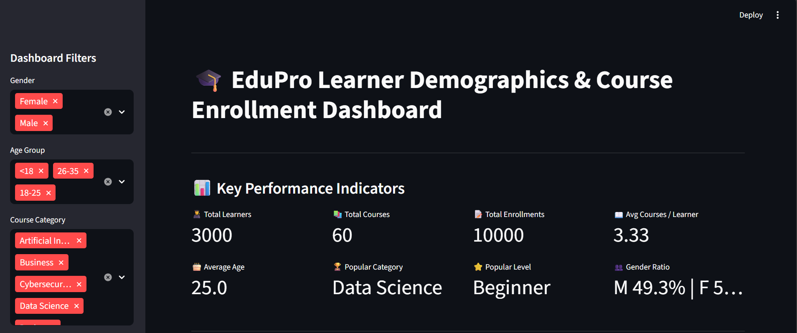
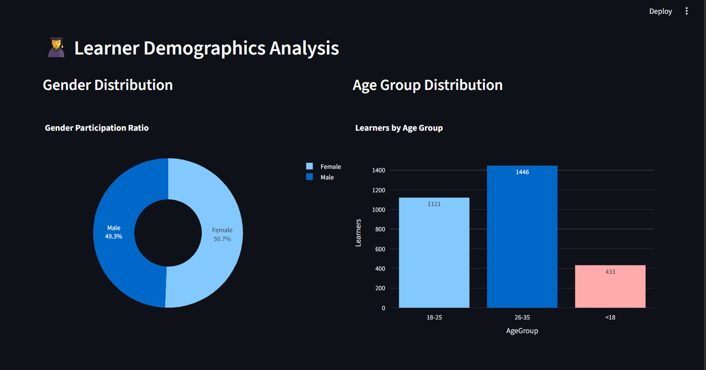
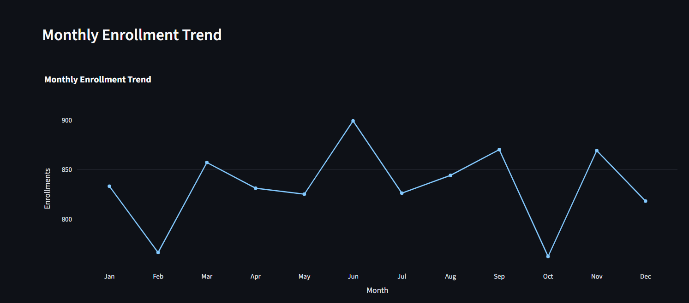

# 🎓 EduPro Learner Demographics & Course Enrollment Analytics Dashboard

<p align="center">


</p>

---

# 📌 Project Overview

The **EduPro Learner Demographics & Course Enrollment Analytics Dashboard** is an interactive Business Intelligence dashboard developed using **Streamlit**, **Pandas**, and **Plotly**.

The dashboard analyzes learner demographics, enrollment behavior, course popularity, and learning patterns to help educational organizations make informed decisions using data-driven insights.

The project integrates multiple datasets into a single analytical platform and provides interactive filtering, advanced visualizations, business recommendations, and downloadable reports.

---

# 🎯 Project Objectives

The primary objectives of this project are:

- Analyze learner demographics
- Study enrollment behavior
- Identify course popularity
- Compare learner participation across age groups
- Analyze gender-based learning patterns
- Study course category, type, and level
- Monitor monthly enrollment trends
- Discover learner behavior patterns
- Generate business insights
- Support strategic decision-making

---

# ✨ Features

## 📊 Dashboard KPIs

- Total Learners
- Total Courses
- Total Enrollments
- Average Courses per Learner
- Average Learner Age
- Most Popular Category
- Most Popular Course Level
- Gender Participation Ratio

---

## 👨‍🎓 Learner Demographics Analysis

- Gender Distribution
- Age Group Distribution
- Age Histogram
- Gender Participation Summary
- Age Group Statistics
- Participation Analysis

---

## 📚 Course Enrollment Analysis

- Course Category Popularity
- Course Type Analysis
- Course Level Distribution
- Monthly Enrollment Trends
- Top 10 Popular Courses
- Enrollment Summary

---

## 📈 Advanced Analytics

- Age Group vs Course Category Heatmap
- Gender vs Course Level
- Gender vs Course Category
- Age Group vs Course Level
- Age Group vs Course Type
- Course Category vs Course Level
- Crosstab Analysis
- Percentage Distribution

---

## 👨‍💻 Learner Behavior Analysis

- Average Courses per Learner
- Top Active Learners
- Enrollment Concentration
- Learner Activity Levels
- Repeat Enrollment Analysis
- Average Courses by Gender
- Average Courses by Age Group

---

## 💡 Business Insights

The dashboard automatically identifies:

- Most Active Age Group
- Highest Participation Gender
- Most Popular Course Category
- Most Preferred Course Level
- Most Enrolled Course
- Average Learning Activity

---

## 🎯 Recommendations

The dashboard generates business recommendations such as:

- Expand high-demand courses
- Introduce beginner-friendly programs
- Increase engagement among underrepresented learners
- Improve marketing strategies
- Encourage repeat enrollments
- Expand advanced learning paths

---

## 📥 Export

Users can download the filtered dataset directly from the dashboard in CSV format.

---

# 📂 Dataset

The dashboard uses an integrated Excel dataset containing learner and enrollment information.

### Dataset Fields

- UserID
- UserName
- Age
- AgeGroup
- Gender
- CourseID
- CourseName
- CourseCategory
- CourseLevel
- CourseType
- TransactionID
- TransactionDate

---

# 🛠️ Technology Stack

| Technology | Purpose |
|------------|----------|
| Python | Programming Language |
| Streamlit | Web Dashboard |
| Pandas | Data Processing |
| Plotly | Interactive Visualizations |
| OpenPyXL | Excel File Handling |

---

# 📊 Dashboard Modules

```
Dashboard
│
├── KPI Dashboard
├── Learner Demographics
├── Course Enrollment Analysis
├── Advanced Analytics
├── Learner Behavior Analysis
├── Business Insights
├── Executive Summary
├── Recommendations
├── Download Dataset
└── Dataset Preview
```

---

# 📁 Project Structure

```
EduPro-Dashboard
│
├── app.py
├── Merged_EduPro.xlsx
├── requirements.txt
├── README.md
├── .gitignore
└── screenshots
    ├── dashboard.png
    ├── demographics.png
    └── enrollment.png
```

---

# ⚙️ Installation

## Clone Repository

```bash
git clone https://github.com/your-username/EduPro-Dashboard.git
```

---

## Navigate to Project

```bash
cd EduPro-Dashboard
```

---

## Install Dependencies

```bash
pip install -r requirements.txt
```

---

## Run Dashboard

```bash
streamlit run app.py
```

---

# 📌 Dashboard Preview

Add screenshots inside the **screenshots** folder.

Example:

```
screenshots/
│
├── dashboard.png
├── demographics.png
├── enrollment.png
├── analytics.png
└── insights.png
```

Then display them:

```md
## Dashboard



## Learner Demographics



## Enrollment Analysis



## Advanced Analytics


## Business Insights


```

---

# 📈 Key Insights Generated

The dashboard automatically identifies:

- Most Active Learners
- Popular Course Categories
- Course Level Preferences
- Gender Participation
- Age Group Distribution
- Monthly Enrollment Trends
- Enrollment Concentration
- Repeat Learners
- Business Opportunities

---

# 🚀 Future Enhancements

- Machine Learning-based Enrollment Prediction
- Recommendation System
- Student Performance Analytics
- Instructor Analytics
- Real-time Database Integration
- Authentication System
- Cloud Deployment
- PDF Report Generation
- Email Notifications
- Predictive Business Intelligence

---

# 🎓 Learning Outcomes

Through this project, the following concepts were implemented:

- Data Cleaning
- Data Integration
- Exploratory Data Analysis
- Interactive Dashboard Development
- Business Intelligence
- Data Visualization
- Streamlit Development
- Plotly Charts
- KPI Reporting
- Data-driven Decision Making

---

# ✅ Project Objectives Achieved

| Objective | Status |
|-----------|--------|
| Data Integration | ✅ |
| KPI Dashboard | ✅ |
| Learner Demographics | ✅ |
| Gender Analysis | ✅ |
| Age Group Analysis | ✅ |
| Course Category Analysis | ✅ |
| Course Type Analysis | ✅ |
| Course Level Analysis | ✅ |
| Monthly Enrollment Trend | ✅ |
| Advanced Analytics | ✅ |
| Learner Behavior Analysis | ✅ |
| Business Insights | ✅ |
| Executive Summary | ✅ |
| Recommendations | ✅ |
| CSV Download | ✅ |
| Interactive Filters | ✅ |

---

# 👨‍💻 Author

**Minesh Naidu**

B.Tech – Artificial Intelligence & Machine Learning

Passionate about Data Analytics, Machine Learning, Business Intelligence, and Dashboard Development.

---

# 📜 License

This project is developed for educational and learning purposes.

Feel free to fork, improve, and contribute.

---

⭐ If you found this project useful, consider giving it a **Star** on GitHub.


## Live Dashboard

Open the EduPro Dashboard:
https://edupro-dashboard-pdj2d5xsccaahatv4aqs3z.streamlit.app/
